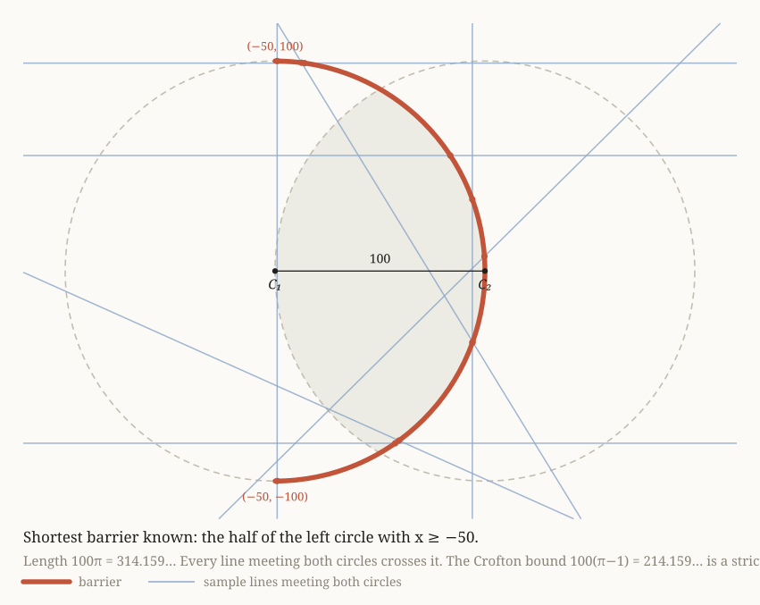
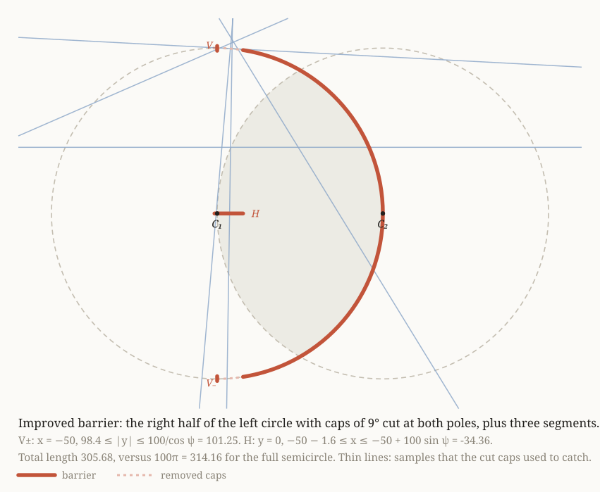

# Shortest barrier meeting every line through two overlapping circles

**Problem.** Two congruent circles of radius `R = 100` have centres `100` apart.
Find the infimum of the total length (1-dimensional Hausdorff measure) of a
rectifiable set, not necessarily connected, that meets every line intersecting
both circles.

Coordinates: `C1 = (-50, 0)`, `C2 = (50, 0)`, `R = 100`, `a = 50`.

---

## 1. Reduction of the family of lines

Parametrise a line by its unit normal `u = (cos t, sin t)` and signed offset `p`:

```
L(t, p) :  x cos t + y sin t = p ,      t in [0, pi),  p in R
```

Signed distances of the centres from `L`:

```
s = p + 50 cos t     (from C1)
q = p - 50 cos t     (from C2)
```

`L` meets disk *i* iff the corresponding distance has absolute value `<= 100`. Hence

```
L meets both circles   <=>   |p| <= g(t) := 100 - 50 |cos t|
```

`F` denotes this family. Note `g` is **not** a support function: at `t = pi/2` the
derivative jumps from `+50` to `-50`, a concave corner. So `F` is *not* the set of
lines meeting some convex body, which is exactly what makes the problem hard.

For comparison, the lens `Λ = D1 ∩ D2` has support function

```
h(t) = 100 - 50|cos t|        for |cos t| >= 1/2
h(t) = 50 sqrt(3) |sin t|     for |cos t| <= 1/2
```

and `h <= g` with strict inequality on `|cos t| < 1/2`. So `F` is strictly larger
than the family of lines meeting the lens.

## 2. Lower bound (Cauchy–Crofton)

With `mu = dp dt` on the space of lines, Cauchy–Crofton reads `2 H^1(S) = ∫ n(L, S) dmu`,
where `n` counts intersections. Any barrier `S` has `n >= 1` on `F`, so `2 H^1(S) >= mu(F)`.

```
mu(F) = ∫_0^pi 2 g(t) dt = 200 pi - 100 ∫_0^pi |cos t| dt = 200 pi - 200
```

```
    inf length  >=  100 (pi - 1)  =  214.159265...
```

## 3. The lower bound is not attained

Equality forces `n = 1` a.e. on `F` **and** `n = 0` a.e. off `F`.
If `S` had a subset of positive length outside the lens `Λ`, pick a point `x` of that
subset with `x ∉ D2` (say). An open cone of directions through a neighbourhood of `x`
gives a positive-measure set of lines meeting `S` and missing `D2`, i.e. `n >= 1` on a
positive-measure subset of the complement of `F`. So equality forces `H^1(S \ Λ) = 0`,
i.e. `S ⊆ Λ` up to a null set.

But `F` contains lines that miss `Λ` entirely, and their measure is positive:

```
mu(F) - perimeter(Λ) = (200 pi - 200) - 400 pi / 3 = 200 pi / 3 - 200 = 9.4395...
```

A set contained in `Λ` cannot meet them. Contradiction. Therefore

```
    inf length  >  100 (pi - 1)   strictly.
```

(The lens perimeter is `400 pi / 3`: two arcs of radius 100 each subtending 120 degrees.)

## 4. Upper bound: the right semicircle of the left circle works

Let `S* = { C1 + 100 (cos φ, sin φ) : φ ∈ [-pi/2, pi/2] }`, the half of circle 1 lying in
`x >= -50`. Its length is `100 pi`.

**Claim.** `S*` meets every line of `F`.

*Proof.* Suppose `L(t, p) ∈ F` misses `S*`. `L` meets circle 1 in two points (a chord),
and missing `S*` means both lie in the open half plane `x < -50`. With
`c = cos t`, `σ = |sin t|`, the chord endpoints have

```
x = -50 + s c ∓ sqrt(100^2 - s^2) σ
```

so both are `< -50` iff `s c < - sqrt(100^2 - s^2) σ`, which forces `s c < 0` and,
after squaring, `|s| >= 100 σ`.

Take `c > 0` (the case `c < 0` is symmetric). Then `s < 0` and `s <= -100 σ`.
Membership in `F` gives `|q| = |s - 100 c| <= 100`, hence `s >= 100c - 100`. Combining,

```
100 c - 100 <= -100 σ    =>    cos t + |sin t| <= 1
```

which is false for `t ∈ (0, pi/2)`. The only solutions are the degenerate `t = 0, pi/2`,
where a chord endpoint lies exactly on `S*`. ∎

```
    inf length  <=  100 pi  =  314.159265...
```

## 5. Picture of the barrier



Generated by `draw_barrier.py`. The thick arc is the barrier `S*`; the thin lines are
samples from `F`, each dotted where it crosses `S*`. Note the near-vertical samples
cross it twice: that redundancy, of measure `100 pi - 200`, is what any improvement on
`100 pi` would have to exploit.

## 5. Result

```
    100 (pi - 1)  <  inf length  <=  100 pi
       214.159...  <   inf       <=   314.159...
```

The exact infimum is **not known in closed form**. This is an instance of the
*opaque set* (barrier) problem, which is open even for the unit square and the unit disk:
for the square the best known bounds are `2` (Crofton) versus `2.0000021` from below and
`2.6389` from above; for the unit disk, `pi` versus `4.7998`. Our ratio
`upper / lower = pi / (pi - 1) = 1.467` is of the same order as the gaps known there,
so closing it is a research-level question, not a computation.

## 6. Two structural facts, verified numerically

**(a) The exceptional lines are cheap to block.** The `F`-lines missing the lens are
exactly those with `|cos t| < 1/2` and `h(t) < |p| <= g(t)`. Every one of them crosses
the `y`-axis at a height `y` with `50 sqrt(3) < |y| <= 100`. Indeed `y = p / sin t`, and
`p <= 100 - 50|cos t| <= 100 sin t` reduces to `2 tan(|t - pi/2| / 2) <= 1`, i.e.
`|t - pi/2| <= 2 arctan(1/2) = 53.13 deg`, which holds on the range `30 deg` in play.

So the two segments `{0} x [50 sqrt 3, 100]` and `{0} x [-100, -50 sqrt 3]`, of total
length `200 - 100 sqrt 3 = 26.7949...`, block every `F`-line that misses the lens.
This gives the alternative (worse) barrier `∂Λ + tips = 400 pi / 3 + 200 - 100 sqrt 3 = 445.67`.

**(b) The semicircle wastes coverage.** The `F`-lines meeting `S*` twice are those with
`|s| >= 100 |sin t|` and `s cos t > 0`; their measure is `100 pi - 200 = 114.16`, about
27 percent of `mu(F)`. Any improvement on `100 pi` has to recycle that double coverage.

## 8. Beating 100 pi: cut the poles

The semicircle `S*` is wasteful at its two poles `(-50, ±100)`. There the lines of `F`
that pass nearby are of only two kinds, nearly horizontal or nearly vertical: the
condition `cos(μ+e) + sin μ <= 1` that membership in `F` imposes on a line through the
pole region has no solutions for intermediate directions. So a short cap of the arc at
each pole can be replaced by short straight segments that catch each kind separately.

**Construction B(ψ).** Fix `ψ` and cut from `S*` the two caps `|φ| > π/2 − ψ`. Add

| piece | definition | catches |
|---|---|---|
| `V+` | `x = −50`, `h* <= y <= 100 / cos ψ` | chords with both ends in the top cap (they meet `x = −50` at height in `[100, 100/cos ψ]`), and near-horizontal lines with one end in the top cap and one at `x < −50` |
| `V−` | mirror image of `V+` | the same for the bottom cap |
| `H` | `y = 0`, `−50 − δ <= x <= −50 + 100 sin ψ` | near-vertical lines from cap to cap (they cross the axis between their endpoints' abscissae), and near-vertical lines passing just left of `C₁` |

Every line of `F` meets `S*` (section 4). If it meets the retained arc it is caught. Otherwise
its two intersections with circle 1 lie in the caps or in the left half, and the case table
above is exhaustive. The thresholds `h*` and `δ` are found by sweeping all `F`-lines that miss
the retained arc and recording where they cross `x = −50` and `y = 0`; the length is then

```
L(ψ) = 100(π − 2ψ) + 2(100 / cos ψ − h*) + 100 sin ψ + δ
```

The optimum is near `ψ = 9°`. With the conservative rounded values `h* = 98.4`, `δ = 1.6`:

| piece | length |
|---|---|
| retained arc, `|φ| <= 81°` | 282.743 |
| `V+` and `V−` | 2 × 2.847 |
| `H` | 17.237 |
| **total** | **305.680** |



Certification (`barrier_v2.py`): zero escapes over 2 000 000 random lines of `F`, a
3001 × 3001 deterministic sweep, and 500 000 samples concentrated near the horizontal and
vertical directions. The unrounded design value is 305.215.

```
    100 (π − 1)  <  inf length  <=  305.68
```

**Why not more.** Cutting the arc anywhere other than the poles is not cheap: through an
interior point of the arc the lines of `F` fill a full range of directions, and the lines
that meet `S*` only there continue into `D₂`, so the replacement has to span the removed
cap. Two natural alternatives were tested and both lose:

- one-sided cut (top pole only): `H` shrinks but the arc saving halves; best 310.6 (`barrier_v4.py`);
- the hybrid "upper-right quarter of circle 1 plus lower-left quarter of circle 2": not a
  barrier at all, `y = −x + 20` meets both disks and misses it (`barrier_v3.py`).

A set-cover LP over grid segments (`lp_barrier.py`) puts weight ½ on a lens-shaped loop,
the usual integrality-gap artefact, and gives no better construction.

## 9. Files

- `draw_barrier.py` — regenerates `barrier.svg`, standard library only.
- `barrier_v2.py` — designs and certifies the improved barrier `B(ψ)` of section 8.
- `draw_barrier2.py` — regenerates `barrier2.svg`.
- `barrier_v3.py`, `barrier_v4.py`, `lp_barrier.py`, `milp_barrier.py` — the rejected alternatives of section 8.
- `verify.py` — pure-Python checks, no third-party packages. It confirms
  `mu(F) = 200(pi-1)`, that `S*` blocks every line of `F` (2 million random lines plus a
  2001 x 2001 deterministic sweep, zero escapes), the exceptional-line measure
  `200 pi / 3 - 200`, and claim 6(a).

Run: `python3 verify.py`

```
mu(F)                      = 428.318530718   (200(pi-1))
Crofton lower bound        = 214.159265359   (100(pi-1))
right semicircle: unblocked F-lines found: 0
upper bound                = 314.159265359   (100 pi)
mu(F minus lines meeting lens) = 9.439510239 (200pi/3 - 200)
tip segments: unblocked lens-missing lines: 0
tip segment total length   =  26.794919243   (200 - 100 sqrt 3)
```
